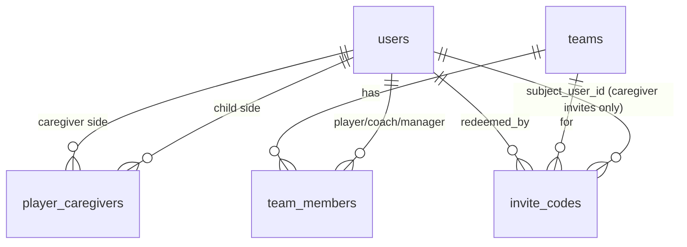

# Design Document

## Overview

This feature replaces "Add Junior" with a single **Add Player** entry point that branches on date of birth, moves adult/junior classification from `teams.age_group` to each person's own date of birth, and closes the caregiver-visibility gap found while shipping Task 1 (the add-a-junior RLS fix, `.kiro/specs/post-registration-welcome-and-team-page/`). It builds directly on the existing `redeem-invite` Edge Function's compensating-transaction pattern, the `invite_codes` table, and the `caregivers-api` / `caregiver_approvals` machinery Task 1 already extended (`link-player-caregiver`, `respond-junior-approval`).

The work divides along the same client/server seam the prior spec established:

- **Client (`src/`)** renders the Add Player form and routes it (Adult vs Junior) using only the DOB entered — a provisional, UI-only decision. It never decides the *record-of-truth* date of birth for an Adult (that is self-declared server-side at redemption) and never writes a `team_members` row for a caregiver.
- **Edge Functions (`supabase/functions/`)** own every privileged decision: invite redemption (role, DOB self-declaration, and — new — whether a `team_members` row is created at all), and the caregiver-link write.
- **Database (`supabase/migrations/`)** adds exactly two nullable columns and one CHECK-constraint change; nothing else moves.

Six things must be reconciled against what exists today:

1. **`users` has no `date_of_birth` column.** Requirement 2 needs one, nullable so existing rows are unaffected (Requirement 2.3/2.4).
2. **`invite_codes.intended_role` allows only `player`/`coach`/`manager`, and there is no way to say which child an invite is about.** Requirement 5 needs `caregiver` added to the valid set and a new nullable `subject_user_id` column.
3. **`redeem-invite`'s `resolveEffectiveRole` applies its result identically to both `users.role` and `team_members.role`** (`supabase/functions/redeem-invite/logic.ts:481-485`, `index.ts:375` and `:437`). Adding `caregiver` to that one function's output would try to insert a `team_members` row with `role = 'caregiver'`, which the database will reject — `team_members.role` is deliberately **not** changing (Requirement 6.1/6.2). The fix is a second, small decision — *does this role get a `team_members` row at all* — not a change to what `resolveEffectiveRole` returns.
4. **`caregivers-api.addJunior` creates the caregiver's account directly** (`createAuthUser` → `create-auth-user` Edge Function, a random password) rather than inviting them. Requirement 4 replaces this with a Caregiver invite through the now-extended `redeem-invite`.
5. **`CaregiverApprovalPage.tsx` has no nav entry anywhere in the app** — confirmed by grep during Task 1's live testing, not fixed there. Requirement 8 is this feature's fix, landing in `MainLayout.tsx`'s existing per-role tab system.
6. **`messaging-api.ts`'s `resolveRecipients('whole_team', ...)` reads only `team_members`** (`messaging-api.ts:348-356`), so a caregiver — who by design (Requirement 6) never has a `team_members` row — is silently excluded from "message the whole team" today. Requirement 6.3 closes this with an additional derived query, not a schema change.

No hard deletes; team names still display as `{age_group} {name}`; no club name, colour, logo, domain, or URL is hardcoded anywhere added here.

## Architecture

### System context

```mermaid
flowchart TD
    subgraph Client [Client - src/]
        APM[Add Player Modal - replaces AddJuniorModal]
        LLP[LiteLandingPage - registration form, +DOB step]
        RP[ResetPassword-style pattern reused for consent redirect]
        MNav[MainLayout - nav badge]
        TP[TeamPage - roster, age band]
    end

    subgraph API [API wrappers - src/lib/]
        IA[invites-api]
        CA[caregivers-api]
        MA[messaging-api]
        RL[roster-logic]
    end

    subgraph Edge [Edge Functions - supabase/functions/]
        RI[redeem-invite - extended]
        LPC[link-player-caregiver - Task 1, unchanged]
        RJA[respond-junior-approval - Task 1, unchanged]
    end

    subgraph DB [(Supabase Postgres + RLS)]
        UT[(users +date_of_birth)]
        TM[(team_members - unchanged)]
        IC[(invite_codes +subject_user_id, +caregiver role)]
        PC[(player_caregivers)]
        AP[(caregiver_approvals)]
    end

    APM --> IA
    APM --> CA
    LLP --> IA
    IA --> RI
    CA --> LPC
    CA --> RJA
    RI --> UT & TM & IC & PC
    MA --> TM & PC
    RL --> UT
    MNav --> AP
    TP --> RL
```

### Where each decision is made (trust boundaries)

| Decision | Owner | Why |
|----------|-------|-----|
| Adult routing at Add Player time | Client (provisional) | Requirement 1.5/1.6 — just picks which form to show next; not the record of truth |
| Adult/Junior classification (record of truth) | `redeem-invite`, self-declared at redemption (Requirement 3.4) or `caregivers-api.addJunior` for a Junior (Requirement 4.1) | Requirement 2.1 — the Manager's routing guess is never persisted as anyone's DOB |
| Whether an invite produces a `team_members` row | `redeem-invite`, keyed on `intended_role` | Requirement 6.1/6.2 — the one place this is decided; the client never decides it |
| Caregiver-team affiliation | Derived at read time (`messaging-api`, and already-existing roster contact logic) | Requirement 6 — never a stored fact |
| Caregiver Approvals visibility | `MainLayout` nav + a first-authenticated-screen check | Requirement 8 — client-side, but reads server data (`caregiver_approvals`) that RLS already scopes to the caller |
| DOB mismatch at redemption | `redeem-invite` | Requirement 3.5 — rejects rather than silently reclassifying, matching the existing `RedeemError` pattern |

### Reused, unchanged infrastructure

Everything Task 1 built stays exactly as it is: `link-player-caregiver` (gated on caller being coach/manager/admin of the specific team), `respond-junior-approval` (does the approval-status update, child activation, and `team_members` insert together), and the `caregiver_approvals` table's `request_kind`/`team_id` columns. This feature's Junior path still ends at "a pending `caregiver_approvals` row exists" exactly as before — the only change is *how the caregiver's account comes to exist* (Requirement 4.3 vs. Requirement 5.4 of the prior spec).

## Components and Interfaces

### 1. Add Player entry point (`src/components/team/AddPlayerModal.tsx`, replaces `AddJuniorModal.tsx`)

Captures first name, last name, and a routing date of birth (Requirement 1.2). Routing is a pure function so it is testable without React:

```typescript
// src/lib/add-player-logic.ts
export interface AddPlayerRoutingInput {
  dateOfBirth: string; // ISO yyyy-mm-dd, as typed by the Manager
  asOf?: Date;          // defaults to now; injectable for tests
}
export type AddPlayerRoute = 'adult' | 'junior';

/** Requirement 1.5/1.6, Requirement 2.1's threshold: 16 or over -> adult. */
export function routeAddPlayer(input: AddPlayerRoutingInput): AddPlayerRoute;
```

`routeAddPlayer(...) === 'adult'` reveals an email field and, on submit, calls the Adult path (below); `=== 'junior'` reveals the existing caregiver name/email/phone fields unchanged from `AddJuniorForm` and calls the Junior path. Requirement 1.7's confirmation step is a plain UI review (no new logic) shown before either submit fires.

### 2. Adult path — self-registration invite (`src/lib/invites-api.ts`, unchanged call shape)

```typescript
// Requirement 3.1 — reuses generateInviteCode exactly as the first-Manager flow does.
await invitesApi.generateInviteCode(teamId, adultEmail, undefined, undefined, 'player');
```

No new client code beyond calling this with `intended_role: 'player'` (Requirement 3.1) and sending it via the existing `send-email` pattern used for Manager invites. The interesting work is entirely server-side (Component 4).

### 3. Junior path — caregiver invite instead of direct creation (`src/lib/caregivers-api.ts`)

`addJunior`'s steps 1-2 (validate, create the child `users` row) and step 5 (pending `caregiver_approvals` row) are unchanged. Step 3 (resolve/create the caregiver) changes:

```typescript
// Before (superseded): this.createAuthUser({ role: 'caregiver', can_sign_in: true, ... })
// After:
if (caregiverResolution.action === 'create') {
  await invitesApi.generateInviteCode(
    teamId,
    normalizedEmail,
    undefined,
    undefined,
    'caregiver',
    /* subjectUserId */ childId, // new optional param — Requirement 4.3, 5.1
  );
  // No caregiverId yet — the player_caregivers link (old step 4) cannot be
  // created until the caregiver's account exists. It moves server-side, into
  // redeem-invite, for the 'caregiver' intended_role (Component 4).
} else {
  // Requirement 4.4 — existing account, unchanged: link immediately via
  // link-player-caregiver (Task 1), exactly as addJunior does today.
}
```

`generateInviteCode` gains one optional trailing parameter:

```typescript
async generateInviteCode(
  teamId: string,
  recipientEmail: string,
  recipientPhone?: string,
  competitionId?: string,
  intendedRole?: 'player' | 'coach' | 'manager' | 'caregiver',
  subjectUserId?: string,   // new — only meaningful (and only set) for 'caregiver'
): Promise<InviteCode>;
```

### 4. `redeem-invite` extensions (`supabase/functions/redeem-invite/`)

Two independent additions to `logic.ts`, both pure and both unit-testable without Deno or a live database:

```typescript
// --- a) Does this intended role get a team_members row? --------------------
// Requirement 6.1/6.2 — the actual fix for reconciliation point 3 above.
// Deliberately separate from resolveEffectiveRole: that function still
// decides users.role identically for all four roles (users.role already
// permits 'caregiver' — it's used that way today via create-auth-user).
// This function decides the one thing that must NOT be uniform.
export type IntendedRole = 'player' | 'coach' | 'manager' | 'caregiver';
export const INTENDED_ROLES: readonly IntendedRole[] = ['player', 'coach', 'manager', 'caregiver'];
export function requiresTeamMembership(role: IntendedRole): boolean {
  return role !== 'caregiver';
}

// --- b) Adult self-declared date of birth -----------------------------------
// Requirement 3.4/3.5. Threshold matches routeAddPlayer's 16-year line
// (Requirement 2.1) — see the Data Models section for why this is NOT the
// same threshold as the existing team-age_group-derived rule, and why that
// gap is accepted rather than silently reconciled here.
export function isAdult(dateOfBirth: string, asOf: Date = new Date()): boolean;
```

Handler changes (`index.ts`), in the same numbered-step structure the file already uses:

- **Step 2 (invite validation):** unchanged, except `effectiveRole` may now resolve toward `'caregiver'` when `invite.intended_role === 'caregiver'` (via `resolveEffectiveRole`, whose valid set grows to match `INTENDED_ROLES` above — its *behaviour* is otherwise identical: unknown/absent/`admin` still degrade to `'player'`).
- **New, before step 4 (profile row):** when `effectiveRole !== 'caregiver'`, require and validate `reg.date_of_birth` (a new field on `NormalizedRegistration`/`validateRequest`, following the file's existing total-validation style — a new `ValidationReason` value `missing_date_of_birth`). If `!isAdult(reg.date_of_birth)`, reject with a new safe message (Requirement 3.5) rather than writing anything — this check runs before any write in this invocation, so there is nothing to compensate.
- **Step 4 (profile row):** `profilePayload` gains `date_of_birth: reg.date_of_birth` (Adult path) — or, for the Caregiver path, no `date_of_birth` at all (caregivers are never asked for one by this feature).
- **Step 5 (team membership) — the key change:** wrapped in `if (requiresTeamMembership(effectiveRole))`. For `'caregiver'`, this step is skipped entirely; a **new step 5b** runs instead:

```typescript
// New step 5b — Requirement 4.6, 5.4. Only for effectiveRole === 'caregiver'.
// invite.subject_user_id is validated to still resolve to a Junior users row
// (Requirement 5.4) — if not, this is a RedeemError, same class as every
// other rejection in this function, and nothing further is written.
// Dedupe (does the link already exist?) mirrors link-player-caregiver's own
// dedupe (Task 1) so redeeming twice, or redeeming after an admin already
// linked the pair some other way, is a no-op rather than an error.
const { error: linkError } = await admin
  .from('player_caregivers')
  .upsert(
    { player_id: invite.subject_user_id, caregiver_id: userId },
    { onConflict: 'player_id,caregiver_id', ignoreDuplicates: true }
  );
```

  This write joins the ledger (`CreationLedger` gains an optional `caregiverLink` entry, `Compensation` gains a `delete_caregiver_link` case) so a later failure — step 6, marking the invite redeemed — unwinds it exactly like every other step, preserving the file's "reverse creation order, only what this invocation created" invariant. Requirement 4.7 is enforced by *absence*: nothing in this step touches `caregiver_approvals`, so the pending consent request is untouched by redemption and still requires the caregiver's separate Approve/Deny action (already built, Task 1's `respond-junior-approval`).
- **Step 7 (return payload):** unchanged shape; `email_confirmed`/`email_confirmation_required` still drive the Success Screen exactly as before. A Caregiver-invite redemption additionally signals `has_pending_approval: true` when a pending `caregiver_approvals` row exists for `subject_user_id`, so the client can implement Requirement 8.2 without a second round trip.

### 5. Caregiver Approvals visibility (`src/layouts/MainLayout.tsx`, `src/pages/LiteLandingPage.tsx`)

`tabsForRole` (`MainLayout.tsx:85-102`) already computes a role-gated, ≤6-tab list. This feature adds one more conditional tab, gated on *data* rather than role — matching Requirement 8.4's "any user with a pending row," not just users who arrived via a Caregiver invite:

```typescript
// New — src/lib/caregivers-api.ts, reused by both MainLayout and the
// post-redemption redirect below. Thin wrapper over the existing
// getMyPendingApprovals (Task 1), returning just the count.
async function getPendingApprovalCount(userId: string): Promise<number>;
```

```typescript
function tabsForRole(role: UserRole | undefined, pendingApprovalCount: number): TabDef[] {
  // ...existing tabs...
  ...(pendingApprovalCount > 0
    ? [{ to: '/caregiver-approvals', label: 'Approvals', color: '#dc2626', icon: ICONS.approvals, badge: pendingApprovalCount }]
    : []),
}
```

`MainLayout` polls or refetches this count the same way it already reads `user` from `useAuth()` — no new global state machinery, just one more query alongside the existing profile fetch. Requirement 8.2 (first-authenticated-screen routing) is implemented in `LiteLandingPage`'s success branch: when `result.has_pending_approval` is true (Component 4's new response field), the Success Screen's primary action links to `/caregiver-approvals` instead of the app root.

### 6. Derived caregiver affiliation for messaging (`src/lib/messaging-api.ts`)

`resolveRecipients`'s `'whole_team'` case gains one additional query, unioned with the existing one:

```typescript
case 'whole_team': {
  const [{ data: members }, { data: caregiverLinks }] = await Promise.all([
    this.supabase.from('team_members').select('user_id').eq('team_id', teamId),
    this.supabase
      .from('player_caregivers')
      .select('caregiver_id, player:team_members!inner(team_id)')
      .eq('player.team_id', teamId),
  ]);
  const ids = new Set([
    ...(members ?? []).map((r: any) => r.user_id),
    ...(caregiverLinks ?? []).map((r: any) => r.caregiver_id),
  ]);
  return Array.from(ids);
}
```

(`player_caregivers.player_id` and `team_members.user_id` reference the same `users(id)`, so the `!inner` embed filters to caregivers whose child is actually on `teamId` — exactly Requirement 6.3's wording.) `'management_team'` is unchanged: caregivers are never coach/manager, so they were never expected there.

### 7. Age band from date of birth (`src/lib/roster-logic.ts`)

`deriveAgeBand(ageGroup)` (the team-only rule, `post-registration-welcome-and-team-page` Requirement 3.9) is kept, unmodified, as the fallback. A new function sits in front of it:

```typescript
/** Requirement 2.1-2.3. Prefers a person's own DOB; falls back to the
 *  team-age_group rule when absent, so existing rosters render unchanged. */
export function deriveAgeBandForPerson(
  dateOfBirth: string | null | undefined,
  ageGroup: string
): AgeBand {
  if (dateOfBirth) return isAdult(dateOfBirth) ? 'adult' : 'child';
  return deriveAgeBand(ageGroup);
}
```

`TeamPage.tsx`'s `contactFor` call site switches from `deriveAgeBand(team.age_group)` (one value for the whole roster) to `deriveAgeBandForPerson(member.date_of_birth, team.age_group)` (per roster row, Requirement 2.5).

## Data Models

### users (add date_of_birth)

```sql
ALTER TABLE public.users ADD COLUMN IF NOT EXISTS date_of_birth date;
```

Nullable, no default — every existing row stays `NULL` (Requirement 2.3/2.4/7.1). Populated by `redeem-invite` for a self-registering Adult (Requirement 3.4) or by `caregivers-api.addJunior` for a Junior (Requirement 4.1); never populated for a `'caregiver'`-role user by this feature.

**Accepted, not resolved here (Requirement 8.3):** `isAdult`'s 16-year threshold (from the privacy draft) and `deriveAgeBand`'s existing U17-grade threshold are different lines. A 16-year-old on a U16 team is `adult` by DOB but `child` by grade. `deriveAgeBandForPerson` resolves this by preferring DOB whenever it's present — meaning this discrepancy becomes *visible* (a real person's contact display can now depend on which rule fires) rather than staying theoretical. Confirming which threshold the club actually wants is out of scope for this document; until then, DOB wins wherever it exists, on the theory that a self-declared fact beats an approximation.

### invite_codes (extend intended_role, add subject_user_id)

```sql
ALTER TABLE public.invite_codes DROP CONSTRAINT IF EXISTS invite_codes_intended_role_check;
ALTER TABLE public.invite_codes ADD CONSTRAINT invite_codes_intended_role_check
  CHECK (intended_role IN ('player', 'coach', 'manager', 'caregiver'));

ALTER TABLE public.invite_codes ADD COLUMN IF NOT EXISTS subject_user_id uuid
  REFERENCES public.users(id);
```

`subject_user_id` is nullable and populated only for a `caregiver`-intended invite, naming chosen to match `event_rsvps.subject_user_id` from the already-agreed caregiver multi-child RSVP design (same underlying concept: "who is this actually about," distinct from who's authenticated). No RLS change: `invite_codes` write access is already scoped to whoever can call `generateInviteCode` today (a permitted team member) or `redeem-invite` (service role) — neither check depends on the new column.

### team_members — explicitly unchanged

No migration. `role` stays `CHECK (role IN ('player', 'coach', 'manager'))` (migration `048`). This is Requirement 6.1/6.2 restated as a data-model fact: the absence of a change here is the design, not an oversight.

### Entity relationships



`player_caregivers` and `team_members` together are how "caregiver of team X" is answered (Requirement 6.1) — there is deliberately no direct edge from a caregiver to a team.

## Correctness Properties

*A property is a characteristic or behavior that should hold true across all valid executions of a system.*

### Property 1: Add Player routing threshold

*For any* routing date of birth, `routeAddPlayer` returns `'adult'` when the person is 16 years or older as of the reference date, and `'junior'` otherwise, with the boundary (exactly 16 today) classified as `'adult'`.

**Validates: Requirements 1.5, 1.6, 2.1**

### Property 2: Adult self-declaration overrides the routing guess

*For any* Add-Player-routed Adult invite redemption, the date of birth persisted on the invitee's `users` row equals the DOB they entered at redemption (via `isAdult`'s input), never the Manager's routing-time entry.

**Validates: Requirements 3.4**

### Property 3: DOB mismatch is rejected, not reclassified

*For any* Adult self-registration invite redeemed with a self-declared date of birth indicating under 16, redemption fails, no `users`, `team_members`, or `invite_codes.redeemed_by` write occurs, and the invite remains redeemable.

**Validates: Requirements 3.5**

### Property 4: A Caregiver-intended invite never produces a team_members row

*For any* invite with `intended_role = 'caregiver'`, successful redemption inserts no row into `team_members` for the redeeming user on any team, regardless of whether that user has other, unrelated `team_members` rows already.

**Validates: Requirements 4.6, 6.1, 6.2**

### Property 5: Caregiver redemption completes the correct link

*For any* Caregiver invite with a given `subject_user_id`, successful redemption results in a `player_caregivers` row `(player_id = subject_user_id, caregiver_id = <redeemer>)` existing exactly once, whether or not one already existed before redemption (idempotent).

**Validates: Requirements 4.6, 5.1**

### Property 6: A vanished subject is rejected

*For any* Caregiver invite whose `subject_user_id` no longer resolves to an existing Junior `users` row at redemption time, redemption fails and no `player_caregivers` row is written.

**Validates: Requirements 5.4**

### Property 7: Redeeming a Caregiver invite never changes approval status

*For any* pending `caregiver_approvals` row linked to a Caregiver invite's subject, redeeming that invite leaves the row's `status` at `pending` — only a subsequent, separate Approve/Deny call changes it.

**Validates: Requirements 4.7**

### Property 8: intended_role still degrades unknown values safely

*For any* invite `intended_role` value, `resolveEffectiveRole` returns the value when it is one of `player`, `coach`, `manager`, `caregiver`; returns `player` when null, absent, or outside that set (including `admin`) — unchanged from the prior spec's Property 18, now over the four-member set.

**Validates: Requirements 5.1 (implicitly, via `INTENDED_ROLES`), and the prior spec's Requirement 6.2-6.5 (regression guard)**

### Property 9: requiresTeamMembership is the single source of the branch

*For any* `IntendedRole`, `requiresTeamMembership` returns `false` if and only if the role is `'caregiver'` — and the `redeem-invite` handler's step-5/step-5b branch reads no other condition to decide this.

**Validates: Requirements 6.1, 6.2**

### Property 10: Whole-team messaging includes affiliated caregivers

*For any* team, its `'whole_team'` roster derived from `team_members`, and any set of `player_caregivers` links where the linked player is a `team_members` row on that team, `resolveRecipients('whole_team', teamId)` returns a set equal to the union of both — with no duplicate when a caregiver is also, independently, a `team_members` row on the same team.

**Validates: Requirements 6.3**

### Property 11: Age band prefers a personal date of birth

*For any* person with a recorded date of birth, `deriveAgeBandForPerson` returns the DOB-derived band regardless of the team's `age_group`; *for any* person without one, it returns exactly what `deriveAgeBand(ageGroup)` already returns today.

**Validates: Requirements 2.2, 2.3, 2.5**

### Property 12: Pending-approval count drives nav visibility

*For any* user, the Caregiver Approvals nav tab is present if and only if `getPendingApprovalCount(userId) > 0`, and its badge value equals that count exactly.

**Validates: Requirements 8.1, 8.3, 8.4**

### Property 13: Successful Caregiver redemption signals the redirect

*For any* Caregiver invite redemption that completes successfully and whose subject has a pending `caregiver_approvals` row, the response's `has_pending_approval` is `true`; otherwise it is `false` or absent.

**Validates: Requirements 8.2**

## Error Handling

### Add Player / redemption

- **DOB mismatch at redemption (Requirement 3.5):** classified as a new `RedeemError` (the file's existing pattern — `safeMessage`, `status`, `detail`, `code`), returned before any write, so `runCompensations` has nothing to undo. The client-facing message tells the invitee this invite is for an adult and directs them to ask the Manager to redo it as a Junior addition — it does not attempt to auto-redirect them into the Junior/consent flow (Requirement 8's out-of-scope note applies the same reasoning here: don't invent a second flow transition inside a rejection path).
- **Vanished `subject_user_id` (Requirement 5.4):** same `RedeemError` pattern, its own `code` (e.g. `subject_missing`), mapped through the existing `mapError`/`SAFE_ERROR_MESSAGES` machinery — no raw DB text reaches the caregiver, consistent with the prior spec's Requirement 2.4/Property 4.
- **Partial failure after the new step 5b:** covered by extending `CreationLedger`/`plannedCompensations` (Component 4) — a failure at step 6 (marking the invite redeemed) now also undoes a freshly-created `player_caregivers` link, in the same reverse-order, created-by-this-invocation-only discipline the function already applies to the auth user, profile row, and team membership.

### Messaging

- **`player_caregivers` embed query fails (Requirement 6.3's new query):** `resolveRecipients` returns the `team_members`-only result rather than failing the whole send — a caregiver being temporarily missing from one message is preferable to no message reaching anyone. Logged, not surfaced to the sender as an error.

### Caregiver Approvals visibility

- **`getPendingApprovalCount` fails:** `MainLayout` renders without the Approvals tab rather than blocking the rest of navigation — matches the existing pattern elsewhere in the app (a failed stat card doesn't take down the dashboard, `post-registration-welcome-and-team-page` Requirement 7.7).

## Testing Strategy

### Dual approach

- **Property-based tests** verify the properties above — `src/lib/add-player-logic.ts` (`routeAddPlayer`), the `redeem-invite/logic.ts` additions (`requiresTeamMembership`, `isAdult`, the extended `resolveEffectiveRole`), `src/lib/roster-logic.ts` (`deriveAgeBandForPerson`), and `src/lib/messaging-api.ts`'s recipient-union logic (extracted to a pure function over two id sets so it doesn't require mocking Supabase for the property test itself).
- **Unit (example) tests** cover concrete wiring: the Add Player form's routed-field visibility (1.5-1.7), the invite-generation call shape for both Adult and Caregiver paths (3.1, 4.3), the nav tab's badge count and colour, and the Success Screen's redirect-vs-normal branch (8.2).
- **Integration tests** cover what property tests can't reach in-process: the full `redeem-invite` compensating-transaction behaviour for a Caregiver invite (create → fail step 6 → confirm the `player_caregivers` row is rolled back), the `player_caregivers`/`team_members` embed query against a real Supabase test project, and an end-to-end Caregiver-invite redemption confirming the linked child's pending approval is untouched (Property 7) and still requires a separate Approve/Deny call.
- **Regression tests** re-run the prior spec's Property 18/19 (`resolveEffectiveRole`, server-ignores-client-fields) against the four-member `INTENDED_ROLES` set, since this feature edits that exact function.

### Property-based testing library and configuration

Same as the prior spec: **fast-check** with **Vitest**, minimum 100 iterations per property, each test tagged `// Feature: add-player-and-dob-age-model, Property {number}: {property_text}`.

### Generators

- **Dates of birth**: spanning well-under-16, just-under-16, exactly-16-today, just-over-16, and well-over-16, plus a fixed reference "now" so property tests are deterministic rather than depending on the real clock.
- **Intended role**: the four valid values plus `admin`, null, absent, and arbitrary strings — regression coverage for Property 8.
- **`team_members` / `player_caregivers` sets**: arbitrary overlapping and non-overlapping combinations (a caregiver who is *also* a direct team member; a caregiver of a child on a *different* team; multiple caregivers per child) to exercise Property 10's union-with-no-duplicates claim.
- **Pending approval counts**: 0, 1, and several, across different `request_kind`/`status` combinations, to exercise Property 12's if-and-only-if.

### Test-first note

`add-player-logic.ts`, the `redeem-invite/logic.ts` additions, and `deriveAgeBandForPerson` are all pure and importable without React, Deno, or a live database — the same discipline the prior spec established, kept here specifically so the trickiest part of this feature (the `team_members`-vs-`caregiver` branch in `redeem-invite`) has a property test that can never accidentally pass by mocking the database into agreeing with itself.
