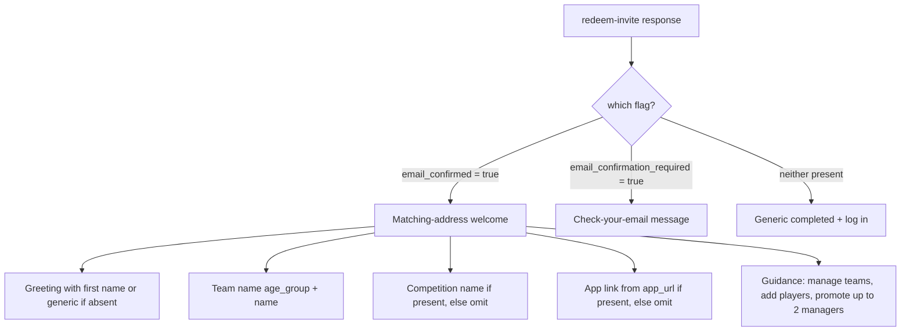
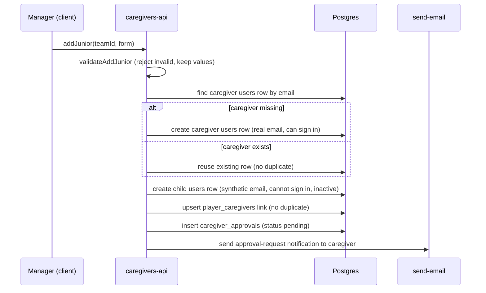
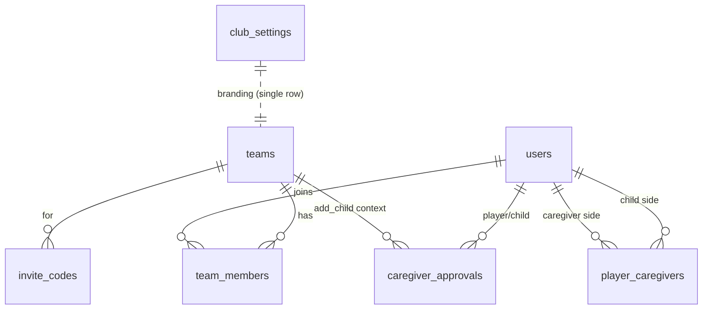

# Design Document

## Overview

This feature (V1.4) delivers the post-invite onboarding experience, the first mobile **Team** page, the foundational **add-a-junior** consent flow, and two defect fixes. It builds directly on the existing `redeem-invite` and `send-email` Edge Functions, the `team_members` roster model, and the invite/caregiver tables introduced in migration `036`.

The work divides cleanly along the existing client/server seam the codebase already enforces:

- **Client (`src/`)** renders roster and success UI, sources all branding from `useClubBranding()` / `club_settings`, and calls typed API wrappers in `src/lib/`. It never decides roles, team type, or branding text for emails.
- **Edge Functions (`supabase/functions/`)** own every privileged decision — role assignment on redemption, confirmation-link generation, and all email composition/branding from environment variables.
- **Database (`supabase/migrations/`)** is the source of truth and the last line of enforcement: RLS and constraints back up the UI's permission model (Manager cap, read-only External League rosters, server-decided roles).

Five things must be reconciled against what exists today, and each is called out where it lands:

1. `invite_codes` has **no intended-role column** — Requirement 6 needs one (migration + `redeem-invite` change).
2. `team_members.role` currently checks only `('player','coach')` (migration `021`) while `manager` is used elsewhere — the Manager role must be a valid team role (migration).
3. `caregiver_approvals` today models *adding a caregiver to an existing player* (`new_caregiver_*` columns). Requirement 5 needs it to also serve as the **consent record for a newly added child**. The design extends the table rather than replacing it.
4. **No team-type marker** exists on `teams`. Club Tournament vs External League drives editability (Requirement 4) and the consent path (Requirement 5), so a `team_type` classification is added.
5. **No `useClubBranding()` hook or `club_settings` table exists yet** (steering marks it "planned"). Requirements 1.4/1.7 depend on it, so a minimal version is defined here.

There are **no hard deletes**; removal is "mark inactive". Team names display everywhere as `{age_group} {name}`. Rosters read from `team_members`. No club name, colour, logo, domain, or URL is hardcoded.

## Architecture

### System context

```mermaid
flowchart TD
    subgraph Client [Client - src/]
        SS[Success Screen - LiteLandingPage]
        TP[Team Page - TeamPage]
        AJ[Add-a-Junior Modal]
        HD[Home Dashboard - Landing]
        CB[useClubBranding hook]
    end

    subgraph API [API wrappers - src/lib/]
        IA[invites-api]
        EA[email-api]
        TA[teams-api / roster-api]
        CA[caregivers-api]
    end

    subgraph Edge [Edge Functions - supabase/functions/]
        RI[redeem-invite]
        SE[send-email]
    end

    subgraph DB [(Supabase Postgres + RLS)]
        UT[(users)]
        TM[(team_members)]
        TE[(teams)]
        IC[(invite_codes)]
        PC[(player_caregivers)]
        AP[(caregiver_approvals)]
        CS[(club_settings)]
    end

    SS --> IA
    TP --> TA
    TP --> CA
    AJ --> CA
    HD --> TA
    CB --> CS
    IA --> RI
    CA --> SE
    RI --> SE
    RI --> UT & TM & IC
    SE -->|Resend| Resend[(Resend API)]
    TA --> TM & TE & PC
    CA --> UT & PC & AP & TM
```

### Where each decision is made (trust boundaries)

| Decision | Owner | Why |
|----------|-------|-----|
| Registrant role & membership role | `redeem-invite` (server) | Req 6.6 — client-supplied `role`/`team_id`/`user_type`/`active` are ignored |
| Confirmation-link generation | `redeem-invite` (server) | Req 2.2 — uses `admin.auth.admin.generateLink` under `service_role` |
| Email copy & club branding | `send-email` (server, env vars) | Req 2.6/2.7 — client passes data only |
| Success-screen branding | `useClubBranding()` / `club_settings` | Req 1.7 — no hardcoded branding in components |
| Team type (editable vs read-only) | `teams.team_type` + RLS | Req 4.3 — enforced at data layer, not just UI |
| Manager cap (max 2) | DB trigger/constraint + RLS | Req 4.10 — rejected even if UI is bypassed |
| Child activation on consent | `caregivers-api` + RLS | Req 5.11 — child inactive until approved |

### Branding sourcing (club-agnostic rule)

- **Client/UI**: `useClubBranding()` reads a single-row `club_settings` table and exposes `{ club_name, primary_color, logo_url, app_url }`. The Success Screen and Team Page consume this — never literals. Where a value is absent, the UI omits the dependent element (Req 1.9–1.11) rather than substituting a hardcoded default.
- **Edge Functions**: `send-email` already sources `CLUB_NAME`, `CLUB_COLOR`, `APP_URL`, `EMAIL_FROM`, `EMAIL_REPLY_TO` from env vars with generic fallbacks. New email types follow the existing `buildTeamInvite` pattern unchanged.

## Components and Interfaces

### 1. Success Screen (`src/pages/LiteLandingPage.tsx`, success branch)

Today the success branch renders a single generic "Welcome!" card. It is replaced by a branded, path-aware screen driven by the existing `redeem-invite` response, which already returns `email_confirmed`, `email_confirmation_required`, `user`, and `team`.

Rendering decision (Req 1.1/1.6/1.8):



Component interface:

```typescript
interface SuccessScreenProps {
  result: RedeemInviteResult;      // from invites-api
  branding: ClubBranding;          // from useClubBranding()
}

// Pure helper (unit + property tested), extracted to src/lib/success-screen-logic.ts
type WelcomeVariant = 'matching' | 'confirmation_required' | 'generic';
function selectWelcomeVariant(result: RedeemInviteResult): WelcomeVariant;
function buildGreeting(firstName: string | null | undefined): string; // generic greeting when empty
function formatTeamLabel(team: { age_group: string; name: string } | null): string | null;
```

### 2. Welcome / confirmation email

Two new `send-email` types share one link-generation + Resend-send implementation, differing only in copy (Req 2.8):

```typescript
// send-email request additions
type EmailRequest =
  | { type: 'team_invite'; to: string; data: TeamInviteData }
  | { type: 'welcome'; to: string; data: WelcomeData }
  | { type: 'confirm_registration'; to: string; data: ConfirmRegistrationData };

interface WelcomeData { recipientName?: string; teamName: string; competitionName?: string; }
interface ConfirmRegistrationData { recipientName?: string; teamName: string; confirmationLink: string; }
```

- **Matching path** (Req 2.1): after `redeem-invite` commits, it (or the client on success) triggers `send-email` type `welcome` to the exact submitted address, within 30s.
- **Non-matching path** (Req 2.2/2.3): `redeem-invite` calls `admin.auth.admin.generateLink` server-side, then triggers `send-email` type `confirm_registration` containing that link. The email includes the one explanatory sentence required by 2.4.
- All onboarding email goes through Resend (`send-email`), never GoTrue SMTP (Req 2.5).

Failure handling (Req 2.9/2.10): link-generation failure on the non-matching path is logged, the account is preserved, and the response signals "confirmation required but email not sent". Welcome-email failure on the matching path is logged and never rolls back the registration.

### 3. Team Page (`src/pages/TeamPage.tsx`, new)

New mobile page under `src/pages/` with `pb-20` (Req 3.12), routed at `/team` inside the authenticated `MainLayout`.

```typescript
interface TeamPageState {
  teams: TeamMemberWithTeam[];      // from team_members join (source of truth)
  selectedTeamId: string | null;    // auto-selected when exactly one team
  roster: RosterEntry[];            // grouped + sorted
  status: 'idle' | 'loading' | 'loaded' | 'error';
}

interface RosterEntry {
  userId: string;
  displayName: string;
  roles: TeamRole[];                // all held roles listed together (Req 3.5)
  active: boolean;
  contact: ContactDisplay;
  pending?: boolean;                // child awaiting consent (Req 5.10)
}

type ContactDisplay =
  | { kind: 'self'; cellphone: string }                     // U17/Open band
  | { kind: 'caregiver'; name: string; cellphone: string }  // U16-and-below
  | { kind: 'missing' };                                    // no caregiver linked
```

Selection behaviour: exactly one team auto-selects and loads (Req 3.2); two-or-more leaves the selector empty with a prompt and no roster (Req 3.13); zero teams shows an empty state (Req 3.14). Roster retrieval shows a loading indicator, and a 10-second timeout yields an error state with a retry that preserves the selection (Req 3.4/3.15).

Pure roster logic is extracted to `src/lib/roster-logic.ts` so it is testable independent of React and Supabase:

```typescript
function deriveAgeBand(ageGroup: string): 'adult' | 'child';       // Req 3.9 (no DOB)
function selectCaregiverContact(caregivers: CaregiverLink[]): ContactDisplay; // primary, else most recent (Req 3.8)
function groupAndSortRoster(members: RosterMember[]): RosterEntry[]; // Coach→Manager→Player; inactive last (Req 3.4/3.6)
function mergeRoles(members: RosterMember[]): RosterEntry[];         // one row per user, roles combined (Req 3.5)
```

### 4. Team Page permissions & actions

Authority resolution (Req 4.1): Admin from `users.role === 'admin'` (club-wide); Coach/Manager from the user's `team_members` role on the *selected* team.

```typescript
interface ActionCapabilities {
  canEditNames: boolean;
  canChangeRole: boolean;
  canDeactivate: boolean;
  canReactivate: boolean;
  canAddUser: boolean;
  canPromoteToManager: boolean;     // false when team already has 2 managers
}

// Pure — src/lib/permissions-logic.ts
function resolveCapabilities(input: {
  isClubAdmin: boolean;
  teamRoles: TeamRole[];
  teamType: TeamType;               // 'club_tournament' | 'external_league'
  managerCount: number;
}): ActionCapabilities;
```

Rules encoded: External League ⇒ all-read-only regardless of role (Req 4.3); Player/Caregiver without Admin ⇒ read-only (Req 4.4); no delete action anywhere (Req 4.5); promote-to-Manager allowed only while `managerCount < 2` (Req 4.8/4.9). Every role still sees the roster; only actions are gated (Req 4.11).

### 5. Add-a-Junior flow (`src/components/team/AddJuniorModal.tsx`, new)

Presented only to permitted users on a Club Tournament team (Req 5.1). Captures caregiver name/email/phone and child first/last name only — no child contact, DOB, or photo (Req 5.2). Validation bounds are a pure function:

```typescript
// src/lib/add-junior-logic.ts
interface AddJuniorForm {
  caregiverName: string;   // 1-100
  caregiverEmail: string;  // valid email, 1-254
  caregiverPhone: string;  // 7-20
  childFirstName: string;  // 1-50
  childLastName: string;   // 1-50
}
type FieldError = keyof AddJuniorForm;
function validateAddJunior(form: AddJuniorForm): { ok: true } | { ok: false; errors: FieldError[] };
```

Server orchestration (in `caregivers-api.addJunior`, backed by RLS/service where auth-user creation is needed):



Consent lifecycle (Req 5.10–5.13): while `pending`, the child stays inactive and appears greyed, non-selectable, with a pending indicator. On `approved`, status + `responded_at` are set and the child is activated. On `denied`/`escalated`, status + `responded_at` are set and the child stays inactive. The `approved` row with `responded_at` is the auditable consent record.

External League children (Req 5.14–5.17): created via import with provenance `external_league`, linked to at least one caregiver, no `caregiver_approvals` step, and shown read-only.

### 6. Redeem-invite role fix (`supabase/functions/redeem-invite/`)

The hardcoded `role: 'player'` in both the profile insert and the `team_members` insert is replaced by the invite's validated intended role. A pure classifier decides the effective role:

```typescript
// supabase/functions/redeem-invite/logic.ts (addition)
type IntendedRole = 'player' | 'coach' | 'manager';
function resolveEffectiveRole(inviteRole: string | null | undefined): IntendedRole;
// null/absent -> 'player'; outside valid set (incl. 'admin') -> 'player'; else the value
```

`resolveEffectiveRole` is applied to both `users.role` and `team_members.role` (Req 6.2/6.3). Server continues to ignore body-supplied privileged fields (Req 6.6). Manager-invite creation sets `intended_role = 'manager'` (Req 6.7).

### 7. Home dashboard teams-count fix (`src/pages/Landing.tsx`)

Today `fetchStats` counts all `teams` rows (`count: 'exact'`), which RLS zeroes for players. The fix derives the player's count from `team_members`:

```typescript
// src/lib/teams-api.ts addition
async function getMyTeamCount(userId: string): Promise<number>; // distinct team_ids in team_members
```

For a player-role user the "Teams" stat shows this personal count (Req 7.1–7.3, 7.5); Admins may still see a club-wide count (Req 7.6); a query failure shows an error indicator for that stat only, leaving others intact (Req 7.7). Games and Coaching pages read team data through a `team_members → teams` join keyed on the current user (Req 7.4).

## Data Models

### club_settings (new — minimal branding source)

Single-row table backing `useClubBranding()`.

```sql
CREATE TABLE IF NOT EXISTS public.club_settings (
  id boolean PRIMARY KEY DEFAULT true CHECK (id = true), -- enforces a single row
  club_name text,
  primary_color text,
  logo_url text,
  app_url text,
  updated_at timestamptz DEFAULT now()
);
ALTER TABLE public.club_settings ENABLE ROW LEVEL SECURITY;
CREATE POLICY "anyone authenticated can read club settings"
  ON public.club_settings FOR SELECT TO authenticated USING (true);
CREATE POLICY "admins manage club settings"
  ON public.club_settings FOR ALL TO authenticated
  USING (EXISTS (SELECT 1 FROM public.users WHERE users.id = auth.uid() AND users.role::text = 'admin'));
```

```typescript
interface ClubBranding {
  club_name: string | null;
  primary_color: string | null;
  logo_url: string | null;
  app_url: string | null;
}
```

### teams (add team_type)

```sql
ALTER TABLE public.teams ADD COLUMN IF NOT EXISTS team_type text
  NOT NULL DEFAULT 'club_tournament'
  CHECK (team_type IN ('club_tournament', 'external_league'));
```

Rationale: editability and the consent path key off a stable per-team classification. Defaulting to `club_tournament` keeps existing app-managed teams editable; imported rosters are marked `external_league`.

### team_members (allow manager role)

```sql
ALTER TABLE public.team_members DROP CONSTRAINT IF EXISTS team_members_role_check;
ALTER TABLE public.team_members ADD CONSTRAINT team_members_role_check
  CHECK (role IN ('player', 'coach', 'manager'));
```

Manager cap enforced at the data layer (Req 4.10) via a trigger:

```sql
CREATE OR REPLACE FUNCTION enforce_manager_cap() RETURNS trigger AS $$
BEGIN
  IF NEW.role = 'manager' THEN
    IF (SELECT count(*) FROM public.team_members
        WHERE team_id = NEW.team_id AND role = 'manager'
        AND id <> COALESCE(NEW.id, gen_random_uuid())) >= 2 THEN
      RAISE EXCEPTION 'manager_cap_reached';
    END IF;
  END IF;
  RETURN NEW;
END;
$$ LANGUAGE plpgsql;

CREATE TRIGGER team_members_manager_cap
  BEFORE INSERT OR UPDATE ON public.team_members
  FOR EACH ROW EXECUTE FUNCTION enforce_manager_cap();
```

### invite_codes (add intended_role)

```sql
ALTER TABLE public.invite_codes ADD COLUMN IF NOT EXISTS intended_role text
  CHECK (intended_role IN ('player', 'coach', 'manager'));
```

Nullable: a null (or invalid) value defaults to `player` in `redeem-invite` (Req 6.4/6.5). `admin` is deliberately excluded from the check set so it can never be granted by redemption.

```typescript
interface InviteCode { /* existing fields */ intended_role: 'player' | 'coach' | 'manager' | null; }
```

### users (child provenance & sign-in capability)

```sql
ALTER TABLE public.users ADD COLUMN IF NOT EXISTS is_child boolean NOT NULL DEFAULT false;
ALTER TABLE public.users ADD COLUMN IF NOT EXISTS child_provenance text
  CHECK (child_provenance IN ('club_tournament', 'external_league'));
```

A child row carries `is_child = true`, a synthetic email, `active = false` until consent, and a `child_provenance` recording its origin (Req 5.16). Caregivers are ordinary `users` rows with real emails that can sign in.

### caregiver_approvals (extend to serve as child consent record)

The table already has `player_id`, `status (pending|approved|denied|escalated)`, `requested_by`, `responded_by`, `responded_at`. Its `new_caregiver_*` columns model the *existing* "add a caregiver to a player" flow and are retained. For the add-a-junior flow the same row is the child's consent record: `player_id` is the newly created child, `requested_by` is the adding Manager, and the caregiver being asked is resolved via `player_caregivers`. To disambiguate the two uses:

```sql
ALTER TABLE public.caregiver_approvals ADD COLUMN IF NOT EXISTS request_kind text
  NOT NULL DEFAULT 'add_caregiver'
  CHECK (request_kind IN ('add_caregiver', 'add_child'));
ALTER TABLE public.caregiver_approvals ADD COLUMN IF NOT EXISTS team_id uuid
  REFERENCES public.teams(id);
```

`request_kind = 'add_child'` rows are the auditable consent record for a Club Tournament child (Req 5.13); `new_caregiver_*` may be reused to hold the supplied caregiver details for that request.

### player_caregivers (unchanged)

`(id, player_id, caregiver_id, unique(player_id, caregiver_id))` is sufficient. "Primary caregiver" for contact display (Req 3.8) is resolved as: a caregiver flagged primary if such a flag exists, otherwise the most recently created link (`created_at`). Since no primary flag exists today and multi-caregiver precedence is an Open Decision, the design uses **most-recently-linked** as the deterministic rule now, leaving room for a `primary boolean` column when precedence is settled.

### Entity relationships



## Correctness Properties

*A property is a characteristic or behavior that should hold true across all valid executions of a system — essentially, a formal statement about what the system should do. Properties serve as the bridge between human-readable specifications and machine-verifiable correctness guarantees.*

These properties cover this feature's pure logic layer. UI rendering, RLS enforcement, and email delivery are covered by example and integration tests instead (see Testing Strategy). Redundant acceptance criteria were consolidated during prework so each property below provides unique validation value.

### Property 1: Welcome variant selection

*For any* `redeem-invite` response, `selectWelcomeVariant` returns `matching` when `email_confirmed` is true, `confirmation_required` when `email_confirmation_required` is true, and `generic` when neither flag is present.

**Validates: Requirements 1.1, 1.6, 1.8**

### Property 2: Team name formatting

*For any* team with an `age_group` and `name`, the rendered team label (on the Success Screen, the Team Page, and in onboarding emails) equals exactly `` `${age_group} ${name}` ``.

**Validates: Requirements 1.2, 2.7, 3.3**

### Property 3: Greeting handles absent names

*For any* first-name value that is null, empty, or entirely whitespace, `buildGreeting` produces a generic greeting containing no empty placeholder or dangling separator; for any non-empty name it includes that name.

**Validates: Requirements 1.9**

### Property 4: Confirmation email includes the explanatory sentence

*For any* `confirm_registration` email data, the composed email (text and HTML parts) includes an explanatory sentence stating the address used differs from the invited address, that confirming completes registration if intentional, and that the recipient may ignore it and re-register with the invited address.

**Validates: Requirements 2.4**

### Property 5: Team selector reflects membership and selection state

*For any* set of `team_members` rows for a user, the Team Page selector options equal the distinct teams in that set; when the set has exactly one team it is auto-selected with its roster shown; when it has two or more, no team is pre-selected and no roster is shown until a selection is made.

**Validates: Requirements 3.1, 3.2, 3.13**

### Property 6: Roster grouping and active ordering

*For any* roster, `groupAndSortRoster` produces entries ordered by group Coach, then Manager, then Player, and within every group no active member appears after an inactive member.

**Validates: Requirements 3.4, 3.6**

### Property 7: Roster merges multiple roles per user

*For any* roster, each user appears exactly once and the roles listed for that user equal the set of all roles that user holds on the selected team.

**Validates: Requirements 3.5**

### Property 8: Contact display by age band

*For any* team and player, `deriveAgeBand` plus `selectCaregiverContact` yields: for the U17/Open band, the player's own cellphone; for the U16-and-below band, the linked caregiver's name and cellphone, choosing the primary caregiver if flagged otherwise the most recently linked; and for the U16-and-below band with no linked caregiver, a missing-contact indication. Age band is derived from `age_group` only, never a date of birth.

**Validates: Requirements 3.7, 3.8, 3.9, 3.11**

### Property 9: Action capabilities honour role and team type

*For any* combination of club-admin authority, held team roles, and team type, `resolveCapabilities`: grants roster-modifying actions only when the user is Coach/Manager/Admin on a Club Tournament team; grants no modifying action when the team type is External League; grants no modifying action when the user holds only Player/Caregiver roles without club-admin authority; never exposes a permanent-delete capability; and always permits the roster to be viewed.

**Validates: Requirements 4.1, 4.2, 4.3, 4.4, 4.5, 4.11, 5.17**

### Property 10: Manager promotion cap

*For any* team, promotion to Manager is permitted when the team has fewer than two Managers and rejected when it already has two, and a rejected promotion leaves the member's current role unchanged.

**Validates: Requirements 4.8, 4.9**

### Property 11: Deactivate/reactivate round trip preserves the record

*For any* roster member, marking inactive sets status inactive while retaining the record, and marking inactive then reactivating restores the member to active with the same underlying record identity (no hard delete occurs on either transition).

**Validates: Requirements 4.6, 4.7**

### Property 12: Add-junior validation rejects out-of-bounds fields

*For any* add-a-junior form input, `validateAddJunior` accepts it only when caregiver name (1–100), caregiver email (valid format, 1–254), caregiver phone (7–20), child first name (1–50), and child last name (1–50) all satisfy their bounds; otherwise it rejects the submission and reports every field that is invalid.

**Validates: Requirements 5.3**

### Property 13: Add-junior writes are idempotent

*For any* caregiver email and child pair, resolving the caregiver reuses an existing `users` row rather than creating a duplicate, and creating the `player_caregivers` link when one already exists produces no duplicate link.

**Validates: Requirements 5.5, 5.7**

### Property 14: Pending child is inactive and non-selectable

*For any* child whose `caregiver_approvals` row (kind `add_child`) is `pending`, the child `users` row is inactive and its roster entry is marked pending and non-selectable.

**Validates: Requirements 5.10**

### Property 15: Consent decision transitions

*For any* pending `add_child` approval, approving sets status `approved`, records `responded_at`, and activates the child; denying or escalating sets status `denied` or `escalated` respectively, records `responded_at`, and leaves the child inactive.

**Validates: Requirements 5.11, 5.12**

### Property 16: Every external-league child is linked to a caregiver

*For any* External League import, every created child record is linked to at least one caregiver contact.

**Validates: Requirements 5.15**

### Property 17: Child provenance is recorded

*For any* created child record, `child_provenance` is set to a value in `{club_tournament, external_league}` matching the record's origin.

**Validates: Requirements 5.16**

### Property 18: Effective role resolution

*For any* invite intended-role value, `resolveEffectiveRole` returns the value when it is one of `player`, `coach`, or `manager`; returns `player` when the value is null or absent; and returns `player` for any other value including `admin`. The resolved role is applied identically to both the profile role and the team-membership role.

**Validates: Requirements 6.2, 6.3, 6.4, 6.5**

### Property 19: Server ignores client-supplied privileged fields

*For any* request body, the values of `role`, `user_type`, `team_id`, and `active` supplied by the client have no effect on the redemption outcome — these are decided server-side.

**Validates: Requirements 6.6**

### Property 20: Personal teams count from team_members

*For any* set of `team_members` rows for a player-role user, the home dashboard "Teams" stat equals the number of distinct `team_id` values in that set (zero when the set is empty), derived from `team_members` rather than a club-wide `teams` count; for a club-admin user a club-wide count may be shown instead.

**Validates: Requirements 7.1, 7.2, 7.3, 7.5, 7.6**

### Property 21: Team query result equals membership

*For any* user, the team result set produced by the Games and Coaching pages' `team_members → teams` join keyed on that user equals the set of teams in the user's `team_members` membership.

**Validates: Requirements 7.4**

## Error Handling

### Registration and email

- **Confirmation-link generation fails (non-matching path, Req 2.9):** `redeem-invite` logs the failure with `console.error`, preserves the created account (no compensation of the account row), and returns a response indicating confirmation is required but the email could not be sent. The Success Screen renders the confirmation-required variant with a note that the email may be delayed.
- **Welcome-email send fails (matching path, Req 2.10):** the failure is logged; the registration transaction is already committed and is never rolled back. Email send is fire-and-forget relative to the registration commit.
- **Safe messages only:** the existing `SAFE_ERROR_MESSAGES` map and the `FORBIDDEN_MESSAGE_FRAGMENTS` render-boundary guard in `LiteLandingPage` are preserved — no database/RLS text reaches the registrant.

### Team Page

- **Roster load timeout (Req 3.15):** if retrieval does not complete within 10 seconds of selection, the page shows an error state with a Retry action that re-attempts while preserving `selectedTeamId`.
- **Empty and no-team states (Req 3.13/3.14):** distinct, explicit states — a select-a-team prompt for multi-team users and a not-a-member empty state for users with no teams — never a silent blank roster.
- **Missing caregiver contact (Req 3.11):** rendered as an explicit "caregiver contact details missing" indication rather than a blank or error.

### Permissions and data-layer enforcement

- **Manager cap bypass (Req 4.10):** the `enforce_manager_cap` trigger raises `manager_cap_reached`; the client maps this to the "maximum of two Managers per team" message and leaves the member's role unchanged. The UI also pre-disables the action, so the trigger is a backstop.
- **External League write attempt (Req 4.3/5.17):** RLS rejects any roster-modifying write on an `external_league` team regardless of the caller's role; the UI exposes no such action in the first place.

### Home dashboard

- **Teams-count query failure (Req 7.7):** the "Teams" stat shows an error indicator; the Users and other stat cards render independently and are unaffected.

### Add-a-junior

- **Validation failure (Req 5.3):** submission is rejected, entered values are retained, and each invalid field is flagged; no rows are written.
- **Partial write failure:** caregiver/child/link/approval writes are ordered so a later failure does not leave a usable child on the roster — a child is created inactive and only becomes visible-as-active after an approval, so an interrupted add leaves an inactive, clearly-pending (or unlinked) record rather than an active child without consent.

## Testing Strategy

### Dual approach

- **Property-based tests** verify the universal properties above across many generated inputs — the pure logic in `src/lib/success-screen-logic.ts`, `src/lib/roster-logic.ts`, `src/lib/permissions-logic.ts`, `src/lib/add-junior-logic.ts`, and the `resolveEffectiveRole` addition in `supabase/functions/redeem-invite/logic.ts`.
- **Unit (example) tests** cover concrete UI content and wiring: guidance text (1.5), competition/app-link presence and omission (1.3/1.4/1.10/1.11), branding sourcing (1.7/2.6), the shared email send path (2.8), form field composition (5.1/5.2), `pb-20` layout (3.12), and manager-invite creation (6.7).
- **Integration tests** cover external and data-layer behavior not suited to PBT: email delivery and 30-second timing (2.1/2.2/2.3/2.9/2.10), approval-request notification (5.9), caregiver/child auth-account creation and sign-in capability (5.4/5.6), the manager-cap trigger (4.10), External League read-only RLS, and the roster-load timeout/retry (3.15). These use 1–3 representative examples with Supabase/Resend stubbed or a test project.
- **Smoke test** confirms onboarding email routes through Resend rather than GoTrue SMTP (2.5).

### Property-based testing library and configuration

- Library: **fast-check** with **Vitest** (the project's TypeScript/Vite toolchain). Property tests are not implemented from scratch.
- Each property test runs a **minimum of 100 iterations** (`{ numRuns: 100 }`).
- Each property test is tagged with a comment referencing its design property, in the format:
  `// Feature: post-registration-welcome-and-team-page, Property {number}: {property_text}`
- Each of the 21 correctness properties is implemented as a **single** property-based test.

### Generators

- **Team**: `age_group` drawn from a set spanning both bands (e.g. `U6, U8, U11, U16, U17, Open`) plus arbitrary suffixes, and arbitrary `name` including apostrophes/unicode to exercise formatting and escaping.
- **Roster members**: arbitrary users with 0–3 roles from `{player, coach, manager}`, `active` boolean, and pending/child flags, to exercise merging, ordering, and pending-child invariants.
- **Caregiver links**: 0–N links with varying `created_at` and optional primary flag, to exercise contact selection and the missing-contact edge.
- **Invite role**: `player | coach | manager | admin | null | ''` plus arbitrary strings, to exercise role resolution and the reject-elevation edge.
- **Add-junior form**: field values spanning below/within/above each length bound, plus valid/invalid email shapes, to exercise validation boundaries.
- **team_members sets**: arbitrary membership with duplicate `team_id`s to confirm distinct-count behavior for the teams stat.

### Test-first note

The pure-logic helpers are extracted specifically so properties can be tested without React or a live Supabase connection. UI components consume these helpers, keeping component tests focused on rendering and wiring rather than logic.
